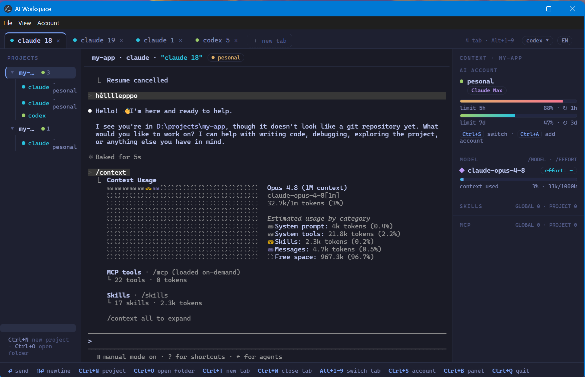

# aiws

Desktop workspace for AI coding CLIs. Run Claude Code, Codex and other agent CLIs side by side, each isolated per project, in one window.



## What it does

aiws embeds the real AI command line tools as live terminals, so you keep the exact CLI experience and gain a project focused workspace around it.

Every project runs in its own isolated profile, so logins, sessions and history never leak between projects. You can sign in to several accounts of the same provider and switch between them inside a running session to get around rate limits.

A conversation started with one provider can carry over to another. Opening Codex in a project that already has a Claude conversation rebuilds it as a native Codex session, so the new agent keeps the context.

The right panel shows the live account, model, reasoning effort, context usage and rate limits for the active terminal.

## Download

Grab the latest build for your platform from the [Releases](https://github.com/vanhbakaa/aiws/releases) page. Windows ships an installer and a portable exe, macOS ships a dmg for Apple Silicon, Linux ships an AppImage and a deb.

The builds are not code signed. On Windows SmartScreen shows a prompt, choose More info then Run anyway. On macOS Gatekeeper blocks the first launch, right click the app and choose Open. On Linux it runs as is.

## Build from source

Node 18 or newer is required.

```bash
npm install
npm run gui:dev        # run in development
npm run gui:package    # build the Windows installer and portable exe
```

## Stack

Electron for the window, React and xterm.js for the interface, on a shared TypeScript core. Terminals use a prebuilt native pty binary, so no compiler toolchain is needed.

## License

Apache 2.0
